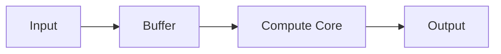

# 技术文章写作模板

> 本文用于验证并演示网站的技术写作能力。复制此文件即可开始一篇新笔记。

## 摘要

用 2～4 句话说明问题背景、本文目标以及读者能够获得什么。不要在摘要里堆砌全部实现细节。

## 问题定义

!!! note "写作提示"
    先说明问题，再给出设计目标。读者应该能够在进入代码前理解为什么要这样设计。

!!! warning "真实数据"
    频率、功耗、面积、资源利用率与精度必须来自真实结果；没有数据时使用 `TBD`。

## 架构与数据流



## 数学表达

行内公式可以写成 $Y = WX + B$。

块级公式：

$$
y_i = \sum_{j=0}^{N-1} w_{ij}x_j + b_i
$$

## 代码展示

```verilog title="counter.v" linenums="1" hl_lines="5 6"
module counter #(
    parameter WIDTH = 8
) (
    input  wire             clk,
    input  wire             rst_n,
    output reg  [WIDTH-1:0] count
);
    always @(posedge clk or negedge rst_n) begin
        if (!rst_n)
            count <= '0;
        else
            count <= count + 1'b1;
    end
endmodule
```

=== "Verilog"

    ```verilog
    assign ready = valid & enable;
    ```

=== "SystemVerilog"

    ```systemverilog
    assign ready = valid && enable;
    ```

## 技术指标

| Metric | Result | Notes |
| --- | --- | --- |
| Frequency | TBD | Post-synthesis / Post-route |
| LUT / Area | TBD | 请注明目标平台 |
| Verification | TBD | 仿真工具与覆盖场景 |

## 实现清单

- [x] 明确问题与设计目标
- [ ] 补充架构图
- [ ] 完成 RTL 与验证
- [ ] 补充综合或 FPGA 结果

## 结论

用简洁的文字总结设计选择、验证结果和下一步工作。必要时可以用脚注补充资料来源。[^1]

[^1]: 脚注可用于补充资料来源或解释，不应承载正文的核心结论。
