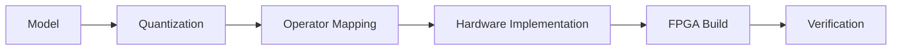

# CNN FPGA Deployment

CNN FPGA Deployment

!!! warning "内容待补充"
    本页是项目记录模板，不包含虚构的器件、资源利用率、频率或模型精度。

## Overview

TBD：说明目标网络、部署目标和项目边界。

## Deployment Flow

## Metrics

  
Model<strong>TBD</strong>

  
Precision<strong>TBD</strong>

  
FPGA<strong>TBD</strong>

  
Toolchain<strong>TBD</strong>

## Model & Quantization

TBD：记录模型来源、预处理、量化方法和软件基线。

## Hardware Mapping

TBD：描述卷积、缓存、带宽、数据复用和算子调度策略。

## FPGA Implementation

TBD：补充时钟、接口、存储布局和实现流程。

## Verification

TBD：说明软件/硬件结果对比、误差标准和板级测试方法。

## Results

| Metric | Result |
| --- | --- |
| Accuracy | TBD |
| Latency | TBD |
| Frequency | TBD |
| LUT / FF / DSP / BRAM | TBD |

## Repository

TBD：确认仓库公开后再添加链接。

[← 返回 Projects](index.md)
