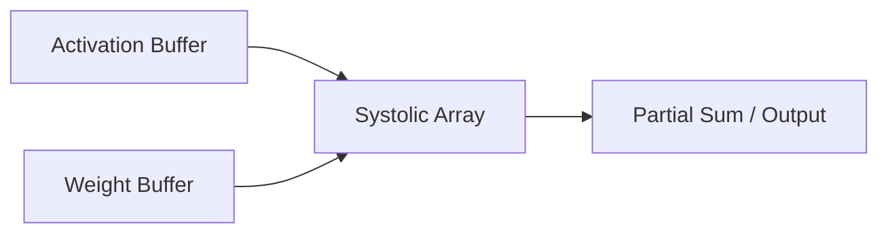

# Systolic Array Architecture

Architecture Dataflow PE

!!! warning "内容待补充"
    本页是项目记录模板。阵列规模、精度、性能和资源数字必须以真实设计结果为准。

## Overview

TBD：说明计算任务、阵列目标和使用场景。

## Architecture

## Metrics

  
Array Size<strong>TBD</strong>

  
Dataflow<strong>TBD</strong>

  
Precision<strong>TBD</strong>

  
Target<strong>TBD</strong>

## Design Goal

TBD：说明吞吐、数据复用、存储访问或可扩展性目标。

## Processing Element

TBD：描述 PE 的输入、输出、内部寄存器和乘加路径。

## Dataflow

TBD：说明输入、权重和部分和如何在阵列中移动。

## Pipeline & Control

TBD：描述流水线、有效信号、边界填充和启动/排空阶段。

## Verification

TBD：记录参考模型、随机测试、边界尺寸和波形检查方法。

## Results

| Metric | Result |
| --- | --- |
| Latency | TBD |
| Throughput | TBD |
| Frequency | TBD |
| Resource / Area | TBD |

## Repository

TBD：确认仓库公开后再添加链接。

[← 返回 Projects](index.md)
