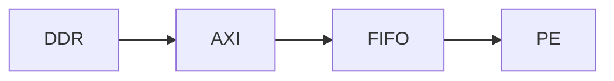

# MkDocs 个人网站二次开发需求文档 / Agent Prompt

## 0. 项目背景

我已经有一个可以正常运行的 MkDocs 个人网站，目前已经完成：

* 本地 MkDocs 环境搭建；
* GitHub 仓库托管；
* 网站已经可以正常访问；
* 已存在 `mkdocs.yml`；
* 已存在一定数量的 Markdown 页面；
* 当前部署流程已经能够正常工作。

本次任务**不是重新创建网站，也不是迁移到 Next.js、Hugo、VuePress 等其他框架**。

本次任务的核心目标是：

> 在现有 MkDocs 项目基础上进行系统性的 UI、内容结构、个人主页、项目展示、技术博客、导航、代码展示、图片展示、SEO 和可维护性增强，使其成为一个长期维护的个人技术主页 / Portfolio / 技术知识库。

---

# 一、最高优先级原则

在进行任何修改之前，请首先完整阅读当前项目。

至少检查：

* `mkdocs.yml`
* 当前目录结构
* `docs/`
* `docs/index.md`
* 现有 CSS
* 现有 JavaScript
* GitHub Actions
* requirements 文件
* 当前 MkDocs 主题
* 已安装插件
* 已启用 Markdown extensions
* 当前部署方式
* 当前导航结构

不要未经检查直接生成一套新的 MkDocs 项目。

## 必须遵守

### 1. 保留现有项目

禁止：

* 删除现有文档；
* 大规模重构已有 Markdown；
* 删除当前部署配置；
* 更换 MkDocs 框架；
* 擅自迁移技术栈；
* 擅自覆盖 `mkdocs.yml`；
* 修改 GitHub Pages 配置导致现有网站失效。

所有改动应尽可能采用：

> 增量修改。

---

### 2. 保证当前网站始终可以构建

每完成一个主要阶段后运行：

```bash
mkdocs build --strict
```

如果当前项目因为历史原因不能使用 `--strict`，至少运行：

```bash
mkdocs build
```

不得留下：

* YAML 错误；
* Markdown 路径错误；
* 无效导航；
* CSS 引用错误；
* JS 报错；
* 插件缺失；
* 静态资源 404；
* GitHub Pages 构建失败。

---

### 3. 不要过度设计

网站定位是：

> 数字 IC / FPGA / AI Accelerator 方向的个人技术主页。

视觉风格应：

* 专业；
* 克制；
* 简洁；
* 技术感；
* 阅读优先。

避免典型 AI Landing Page 风格：

* 大量渐变；
* 发光边框；
* 粒子动画；
* 3D 球；
* 鼠标跟随动画；
* 满屏动态背景；
* 大量无意义动画；
* 过多玻璃拟态；
* 每个元素都使用圆角卡片。

UI 的作用是突出内容。

---

# 二、网站整体定位

网站整体应承担四个功能：

## 1. 个人主页

让访问者快速知道：

* 我是谁；
* 我的研究方向；
* 我的技能；
* 我的代表项目；
* 如何联系我。

---

## 2. Project Portfolio

系统展示个人项目。

重点方向包括：

* Digital IC
* RTL Design
* FPGA
* Computer Architecture
* AI Accelerator
* Systolic Array
* CNN FPGA Deployment
* Mixed Precision Computing
* ANN / SNN Computing

Projects 应成为网站的核心模块之一。

---

## 3. 技术博客 / 知识库

用于长期记录：

* Verilog
* SystemVerilog
* FPGA
* APB
* AHB
* AXI
* UART
* CDC
* SRAM
* FIFO
* CNN
* TPU
* Systolic Array
* Computer Architecture
* Synopsys DC
* VCS
* Verdi
* Quartus
* Vivado
* Linux
* Git
* Makefile
* Python
* 科研笔记

---

## 4. Resume / Research Profile

展示：

* Education
* Research
* Skills
* Projects
* Publications
* Patents
* Awards
* Experience
* Contact

---

# 三、建议的网站信息架构

在不破坏现有内容的前提下，逐步整理为：

```text
Home
│
├── About
│
├── Projects
│   ├── AI Accelerator
│   ├── FPGA
│   ├── RTL / Digital IC
│   └── Other Projects
│
├── Research
│   ├── Research Interests
│   ├── Publications
│   └── Patents
│
├── Notes / Blog
│   ├── Digital IC
│   ├── FPGA
│   ├── Computer Architecture
│   ├── AI Accelerator
│   ├── Tools
│   └── Misc
│
├── Resume
│
└── Contact
```

不要为了符合该目录结构强制移动所有旧文章。

优先：

1. 保持已有 URL；
2. 保持已有文章可访问；
3. 新增统一结构；
4. 后续逐步整理历史内容。

---

# 四、首页设计

重新优化 `docs/index.md`。

首页应该是：

> Personal Landing Page + Selected Projects + Research Profile

而不是传统 MkDocs 的“文档首页”。

---

## 首页 Section 1：Hero

包含：

### 姓名

```text
冯俊杰
```

如果现有网站使用英文名，可以保留现有设置。

### Subtitle

例如：

```text
Digital IC · FPGA · AI Accelerator
```

或：

```text
Digital IC / FPGA / Computer Architecture
```

### 简短介绍

控制在 2～4 行。

例如：

```text
Interested in digital IC design, FPGA systems and AI accelerators.
Currently exploring systolic arrays, mixed-precision computing,
and ANN/SNN heterogeneous architectures.
```

具体文字不要擅自虚构个人经历。

如果仓库中没有真实个人信息：

使用明显 placeholder，例如：

```text
[TODO: Personal Introduction]
```

不要编造学校、公司、论文、奖项。

---

## Hero 操作按钮

建议：

```text
Projects
GitHub
Resume
```

如果 GitHub URL、Resume 文件不存在，则不要伪造。

允许暂时显示：

```text
TODO
```

---

# 五、Selected Projects

首页增加：

```text
Selected Projects
```

展示 3～6 个核心项目。

每个项目卡片包含：

* 项目名称；
* 一句话描述；
* 关键词；
* 项目图片；
* 项目详情链接；
* GitHub 链接（如果存在）。

例如：

```text
Mixed-Precision ANN/SNN PE

BF16 / INT8 / multi-timestep SNN
heterogeneous multiply-accumulate architecture.

BF16 · INT8 · SNN · RTL
```

不要虚构：

* Frequency
* Power
* Area
* FPGA utilization
* TOPS
* Accuracy

这些数字必须来自真实材料。

---

# 六、Projects 页面设计

建议建立：

```text
docs/projects/
```

例如：

```text
docs/projects/index.md
docs/projects/mixed_precision_pe.md
docs/projects/systolic_array.md
docs/projects/cnn_fpga.md
```

但如果已有目录结构，优先兼容现状。

---

# 七、统一 Project 页面模板

每个大型项目建议采用以下结构：

```markdown
# Project Name

## Overview

## Motivation

## Architecture

## Key Features

## My Work

## Hardware Architecture

## Dataflow

## Processing Element

## Pipeline

## Verification

## Synthesis

## FPGA Implementation

## Results

## Gallery

## Repository

## Related Notes
```

不是每个项目都必须填写所有 Section。

---

# 八、项目页必须强调“技术过程”

不要把 Project 页面写成普通简历 bullet list。

应该体现：

```text
Problem
↓
Design Goal
↓
Architecture
↓
Implementation
↓
Verification
↓
Result
```

项目页面应该能够让数字 IC / FPGA 面试官快速理解：

* 为什么设计；
* 架构是什么；
* 数据怎么流动；
* 哪部分是我的工作；
* 如何验证；
* 性能怎么样。

---

# 九、项目技术指标组件

为项目页设计统一的 Metrics 展示格式。

例如：

```text
Precision     BF16 / INT8
Array Size    16 × 16
Target        FPGA
Language      Verilog
Verification  VCS
```

如果没有真实数据：

不要自动填写。

使用：

```text
TBD
```

---

# 十、Research 页面

新增或优化：

```text
Research
```

包含：

## Research Interests

例如：

* AI Accelerators
* Systolic Arrays
* Mixed-Precision Computing
* ANN/SNN Hardware
* Computer Architecture
* FPGA Acceleration

必须允许之后非常方便地增删。

---

## Publications

支持统一格式，例如：

```text
Title
Authors
Conference / Journal
Year
PDF
DOI
GitHub
```

如果当前没有公开论文：

页面仍然可以存在，但不要虚构论文。

---

## Patents

统一格式：

```text
Patent Name
Inventors
Patent Number
Status
Year
```

仅使用仓库已有真实信息。

---

# 十一、技术博客系统

继续以 Markdown 为核心。

不要引入数据库。

建议内容结构：

```text
docs/notes/
├── digital_ic/
├── fpga/
├── architecture/
├── ai_accelerator/
├── tools/
└── misc/
```

如果已有大量旧目录：

不要强制迁移。

---

# 十二、Markdown 能力

检查并合理配置 Markdown Extensions。

希望支持：

## Admonition

```markdown
!!! note
    Note content.
```

## Tabs

```markdown
=== "Verilog"

=== "SystemVerilog"
```

## Code block

````markdown
```verilog
module example;
````

````

## Line highlighting

## Code annotations

## Footnotes

## Tables

## Task lists

## Definition lists

## Keyboard keys

## Attributes

## HTML snippets

---

# 十三、代码展示

代码阅读体验非常重要。

网站未来会大量展示：

- Verilog
- SystemVerilog
- Python
- C
- C++
- Bash
- Makefile
- TCL
- YAML

代码块应支持：

- Syntax Highlight；
- Copy；
- Line Number；
- Highlight specific line；
- Filename / title；
- 横向滚动；
- Mobile 下不爆版。

例如：

```markdown
```verilog title="apb_slave.v" linenums="1"
always @(posedge pclk) begin
    ...
end
````

````

---

# 十四、数学公式

网站必须支持 LaTeX。

例如：

```text
E = mc^2
````

以及：

```latex
Y = WX + B
```

需要检查当前 MkDocs 技术方案。

优先兼容现有环境。

可以采用当前项目主题推荐的 MathJax / KaTeX 方案。

必须确保：

* inline formula；
* block formula；
* dark mode；
* mobile；

显示正常。

---

# 十五、Mermaid

需要支持 Mermaid。

用于：

* FSM；
* 系统框图；
* 数据流；
* AXI；
* APB；
* Systolic Array；
* 软件流程。

例如：



必须验证：

* light mode；
* dark mode；
* mobile。

---

# 十六、图片系统

项目以后会有大量：

* Architecture Diagram
* RTL Viewer
* Verdi Waveform
* Quartus Screenshot
* Vivado Screenshot
* FPGA Board Photo
* Result Chart
* Paper Figure

建议统一：

```text
docs/assets/
```

或者沿用现有 assets 目录。

推荐：

```text
assets/
├── images/
│   ├── projects/
│   ├── blog/
│   └── common/
│
├── stylesheets/
└── javascript/
```

不要让图片散落在根目录。

---

# 十七、图片展示效果

实现或配置：

* 图片居中；
* 合理最大宽度；
* Caption；
* 圆角适度；
* Lightbox；
* 点击放大；
* Mobile 自适应。

对于架构图应该允许：

```text
点击 → 查看大图
```

---

# 十八、表格

技术博客会频繁出现：

```text
Resource
LUT
FF
DSP
BRAM
Frequency
```

因此表格应该：

* Desktop 美观；
* Mobile 可以横向滑动；
* 不破坏页面宽度；
* Dark Mode 正常。

---

# 十九、Navigation

优化顶部导航和侧边栏。

要求：

* 当前页面高亮；
* 清晰层级；
* 不超过必要深度；
* 技术文章有 Table of Contents；
* 项目页能快速回到 Projects。

不要让用户面对一个包含几十个一级菜单的 Navigation。

---

# 二十、目录导航

长文章需要右侧：

```text
Table of Contents
```

至少包含：

```text
H2
H3
```

不要显示过多 H4/H5 导致目录混乱。

---

# 二十一、搜索

保留或增强 MkDocs 搜索。

必须能搜索：

* 标题；
* 正文；
* 技术关键词。

例如：

```text
APB
PENABLE
Systolic Array
BF16
FIFO
```

---

# 二十二、Dark Mode

如果当前主题支持：

启用 Light / Dark Mode。

要求：

* 与系统主题兼容；
* 手动切换；
* 代码正常；
* Mermaid 正常；
* 数学公式正常；
* 表格正常；
* 图片不会出现奇怪背景。

---

# 二十三、Typography

整体字体以阅读体验优先。

要求：

* 中文显示自然；
* 英文代码字体清晰；
* 不加载大量字体资源；
* Heading 层级明显；
* 正文 line-height 舒适。

代码字体使用可靠的 monospace stack。

---

# 二十四、内容宽度

技术博客不能过窄。

特别是：

* RTL；
* 表格；
* Architecture；
* Waveform。

可以适当增加 content width。

但普通文章不要变成整屏超宽文本。

需要兼顾：

```text
Text readability
+
Technical content width
```

---

# 二十五、首页和文档页面应该区别对待

首页允许：

* 更宽布局；
* Card；
* Hero；
* Project Grid。

普通技术文章：

保持传统 Documentation layout。

不要为了首页设计破坏所有文章页面。

---

# 二十六、自定义 CSS

统一放在：

```text
docs/assets/stylesheets/
```

或者沿用现有 CSS 目录。

避免把大量 CSS 直接写进：

```text
mkdocs.yml
```

CSS 应：

* 分模块；
* 添加注释；
* 避免 `!important` 泛滥；
* 避免破坏主题默认组件。

例如：

```text
custom.css
homepage.css
projects.css
```

如果项目规模不大，也可以合并为一个文件。

优先简单。

---

# 二十七、自定义 JavaScript

原则：

> 能不用 JS 就不用 JS。

必须使用 JS 时：

统一放置。

不要引入：

* React；
* Vue；
* jQuery；
* 大型 UI Framework。

除非现有项目已经依赖。

---

# 二十八、响应式布局

必须检查：

```text
Desktop
Tablet
Mobile
```

重点测试：

* Homepage；
* Navbar；
* Project Grid；
* Code；
* Tables；
* Mermaid；
* Formula；
* Images；
* Sidebar；
* Search。

宽度至少测试：

```text
375 px
768 px
1440 px
```

---

# 二十九、Resume

建立或优化：

```text
Resume
```

网页 Resume 结构：

```text
Education
Research
Projects
Skills
Publications
Patents
Experience
Awards
```

只使用真实存在的信息。

---

# 三十、PDF Resume

如果仓库存在 PDF Resume：

提供：

```text
Download Resume
```

不要修改 PDF。

如果不存在：

预留位置即可。

不要虚构 PDF 文件。

---

# 三十一、Contact

Contact 页面保持简单。

例如：

```text
GitHub
Email
LinkedIn
Google Scholar
```

只有仓库中存在真实链接时才展示。

不要猜测个人账号。

---

# 三十二、Footer

统一 Footer。

建议：

```text
© YEAR NAME
Built with MkDocs
```

可以附带：

```text
GitHub
```

不要堆很多信息。

---

# 三十三、SEO

检查并增强：

```text
site_name
site_description
site_author
site_url
```

以及：

* sitemap；
* robots；
* canonical URL；
* OpenGraph；
* social preview。

如果插件需要新增依赖：

先判断是否值得。

避免为了 SEO 引入大量复杂依赖。

---

# 三十四、Favicon

检查：

```text
favicon
```

如果已有：

保留。

如果没有：

预留。

不要随意生成奇怪 Logo。

---

# 三十五、404 页面

增加简单的 404 页面。

例如：

```text
Page not found

Home
Search
```

视觉风格与网站一致。

---

# 三十六、GitHub Repository

如果网站仓库本身公开：

Header 或 Footer 可增加：

```text
View on GitHub
```

如果 repo 为 private：

不要添加无意义入口。

---

# 三十七、部署

现有 GitHub 部署方式必须保持正常。

请检查：

```text
.github/workflows/
```

或当前使用的：

```text
mkdocs gh-deploy
```

不要未经必要修改 CI/CD。

---

# 三十八、依赖管理

检查当前依赖方式：

可能是：

```text
requirements.txt
```

或者：

```text
pyproject.toml
```

只增加真正需要的插件。

每增加一个依赖，都必须确认：

1. 是否必要；
2. 是否兼容当前 MkDocs；
3. 是否兼容当前主题；
4. GitHub Actions 是否能够安装；
5. 是否影响现有构建。

---

# 三十九、不要过度插件化

MkDocs 插件越多：

维护成本越高。

优先顺序：

```text
Native MkDocs
↓
Current Theme Feature
↓
Markdown Extension
↓
Small Plugin
↓
Custom JavaScript
```

---

# 四十、性能

个人网站应该保持轻量。

目标：

* 尽量 Static；
* 少 JS；
* 图片优化；
* 避免大型第三方库；
* 避免首页加载大量图片；
* Lazy load。

---

# 四十一、Accessibility

至少检查：

* Heading hierarchy；
* 图片 alt；
* button / link distinction；
* dark mode contrast；
* keyboard navigation；
* focus state。

---

# 四十二、内容维护体验

这是非常重要的设计目标。

以后增加一篇文章应该只需要：

```text
创建 Markdown
↓
加入导航
↓
git commit
↓
git push
```

而不是修改多个 HTML / JS 文件。

---

# 四十三、Project 数据维护

如果项目数量增加，可以考虑：

```text
Markdown metadata
```

例如：

```yaml
---
title: Mixed Precision PE
description: BF16 / INT8 / SNN heterogeneous PE
tags:
  - RTL
  - BF16
  - FPGA
status: active
---
```

但不要为了数据驱动而创建复杂 build system。

---

# 四十四、Front Matter

可以为文章逐步建立统一 front matter。

例如：

```yaml
---
title: APB Protocol
date: 2026-08-10
categories:
  - Digital IC
tags:
  - APB
  - AMBA
---
```

现有文章没有 metadata 的情况下：

不要一次性强制迁移所有文章。

---

# 四十五、URL 稳定

非常重要。

已经存在的页面 URL：

尽量不变。

如果必须修改：

考虑 redirect。

避免导致：

```text
Google index
GitHub link
收藏链接
```

全部失效。

---

# 四十六、Git Workflow

修改前建议：

```bash
git status
```

确认工作区状态。

修改过程中：

不要删除用户未提交内容。

不要自动执行：

```bash
git reset --hard
```

不要：

```bash
git clean -fd
```

不要覆写用户本地修改。

---

# 四十七、修改策略

按以下阶段进行。

---

## Phase 1：Repository Audit

首先输出项目审查结果：

```text
Current Theme
Current Plugins
Markdown Extensions
Navigation
Assets
Deployment
Potential Problems
Recommended Changes
```

然后再开始修改。

---

## Phase 2：Infrastructure

处理：

* mkdocs.yml；
* Markdown Extensions；
* CSS；
* JS；
* Assets；
* Plugins。

---

## Phase 3：Homepage

优化：

```text
docs/index.md
```

实现：

* Hero；
* About；
* Selected Projects；
* Research Interests；
* Recent Notes；
* Contact。

---

## Phase 4：Projects

建立：

```text
Projects Index
Project Template
Project Cards
```

---

## Phase 5：Technical Writing Experience

完善：

* Code；
* Mermaid；
* Math；
* Tables；
* Images；
* Admonitions；
* Tabs。

---

## Phase 6：Responsive

检查：

```text
375
768
1440
```

---

## Phase 7：SEO & Metadata

完善：

* title；
* description；
* favicon；
* sitemap；
* social preview。

---

## Phase 8：Build Validation

最终运行：

```bash
mkdocs build --strict
```

如果成功：

报告结果。

---

# 四十八、输出修改报告

任务完成后，请提供：

## Files Modified

例如：

```text
mkdocs.yml
docs/index.md
docs/assets/stylesheets/custom.css
docs/projects/index.md
```

---

## Dependencies Added

例如：

```text
mkdocs-material
pymdown-extensions
```

说明每个依赖的用途。

---

## Features Added

例如：

```text
Homepage
Project Cards
Mermaid
Math
Lightbox
Dark Mode
```

---

## Remaining TODO

明确哪些信息因为缺少真实个人数据无法完成。

例如：

```text
TODO: GitHub URL
TODO: Resume PDF
TODO: Project benchmark
TODO: Personal photo
```

---

# 四十九、禁止事项

不得：

* 编造我的经历；
* 编造学校；
* 编造公司；
* 编造论文；
* 编造专利；
* 编造 GitHub；
* 编造项目性能；
* 编造 FPGA 型号；
* 编造芯片指标；
* 编造联系方式；
* 删除已有文章；
* 擅自迁移框架；
* 大规模重构；
* 修改 GitHub 历史；
* 使用 destructive git command；
* 引入数据库；
* 引入后端；
* 引入 Node.js 项目；
* 引入 React/Vue；
* 为简单效果引入大型依赖。

---

# 五十、UI 设计目标

最终网站整体感觉希望接近：

```text
Technical
Minimal
Clean
Professional
Readable
Engineering-oriented
```

视觉上参考：

```text
GitHub
Vercel
Linear
Material for MkDocs
Technical Documentation
Academic Personal Website
```

但不要直接复制任何网站。

---

# 五十一、设计语言

建议：

```text
Background:
White / Near White

Dark Mode:
Dark Gray / Near Black

Text:
High contrast gray

Accent:
Single accent color
```

不要同时使用大量：

```text
Red
Orange
Green
Blue
Purple
```

Accent Color 保持统一。

---

# 五十二、卡片风格

Project Cards：

* 边框轻；
* 阴影极弱；
* 圆角适度；
* Hover 动画轻微；
* 不要浮动太大；
* 不要发光。

Hover 可以：

```text
translateY(-2px)
```

或轻微 border change。

---

# 五十三、动画

原则：

> Animation should provide feedback, not decoration.

只允许非常轻微：

* Hover；
* Fade；
* Navigation transition。

不要：

* full-page loading；
* typewriter；
* particles；
* parallax；
* 3D。

---

# 五十四、文章阅读体验

正文：

* 每行文字不要过长；
* Heading spacing 明确；
* paragraph spacing 舒适；
* list 层级明显；
* inline code 清晰；
* blockquote 容易识别。

---

# 五十五、首页最终理想结构

```text
────────────────────────────────

NAME

Digital IC · FPGA · AI Accelerator

Short Introduction

[Projects] [GitHub] [Resume]

────────────────────────────────

Selected Projects

┌─────────────┐
│ Project     │
└─────────────┘

┌─────────────┐
│ Project     │
└─────────────┘

┌─────────────┐
│ Project     │
└─────────────┘

────────────────────────────────

Research Interests

Digital IC
AI Accelerator
Systolic Array
ANN / SNN
FPGA

────────────────────────────────

Recent Notes

APB Protocol
Systolic Array
AXI
...

────────────────────────────────

About

────────────────────────────────

Contact

────────────────────────────────
```

---

# 五十六、Project Page 理想结构

例如：

```text
Mixed-Precision ANN/SNN Processing Element

BF16 · INT8 · SNN · RTL

Overview

Architecture

[Architecture Diagram]

Key Features

- BF16
- INT8
- ANN
- SNN

Processing Element

[PE Diagram]

Pipeline

[Pipeline Diagram]

Verification

[VCS Waveform]

Synthesis Results

| Metric | Result |
|---|---|
| Frequency | ... |
| Area | ... |

FPGA Implementation

[FPGA Diagram]

Repository
```

---

# 五十七、重要：真实内容优先

如果真实数据暂时没有：

宁愿：

```text
Coming Soon
```

或者：

```text
TBD
```

也不要自动生成虚假的技术指标。

---

# 五十八、重要：先分析，再修改

开始开发前：

请首先阅读完整仓库，并输出简短分析：

```text
I found:

Theme:
Plugins:
Current structure:
Deployment:
Existing customization:

I plan to modify:

1.
2.
3.
```

之后直接开始实施。

除非出现会导致数据丢失或架构选择完全无法判断的问题，否则不要频繁要求我确认。

---

# 五十九、重要：合理自主决策

对于以下小问题：

可以自行决定：

* CSS spacing；
* card padding；
* heading size；
* mobile breakpoint；
* 文件命名；
* 小型结构调整。

对于重大变化：

优先维持现状。

---

# 六十、最终验收标准

最终版本至少满足：

### Function

* [ ] MkDocs 正常运行
* [ ] GitHub Pages 正常部署
* [ ] 现有页面可访问
* [ ] Search 正常
* [ ] Navigation 正常
* [ ] Code highlighting 正常
* [ ] Mermaid 正常
* [ ] Math 正常
* [ ] Images 正常
* [ ] Dark mode 正常

### Homepage

* [ ] Hero
* [ ] Personal Introduction
* [ ] Projects
* [ ] Research Interests
* [ ] Recent Notes
* [ ] Contact

### Projects

* [ ] Projects landing page
* [ ] Project card
* [ ] Project detail template
* [ ] Technical image support
* [ ] Result table support

### Responsive

* [ ] Desktop
* [ ] Tablet
* [ ] Mobile

### Engineering

* [ ] No broken links
* [ ] No missing assets
* [ ] No unnecessary dependency
* [ ] No destructive refactor
* [ ] No fake content
* [ ] Build succeeds

---

# 六十一、第一步立即执行的任务

现在请不要重新创建项目。

请执行以下工作：

1. 阅读整个现有 MkDocs 仓库；
2. 分析当前 MkDocs 配置；
3. 分析当前主题；
4. 分析插件；
5. 分析 Markdown Extensions；
6. 分析 docs 目录；
7. 分析首页；
8. 分析导航；
9. 分析自定义 CSS / JS；
10. 分析 GitHub Pages 部署；
11. 找出当前项目适合保留的部分；
12. 找出需要优化的部分；
13. 给出简短实施计划；
14. 直接开始第一阶段改造；
15. 每完成一个阶段运行构建验证；
16. 不破坏当前能够正常访问的网站。

最终目标：

> 将现有 MkDocs 网站逐步建设为一个简洁、专业、长期可维护的数字 IC / FPGA / AI Accelerator 个人主页、项目 Portfolio 和技术知识库。
